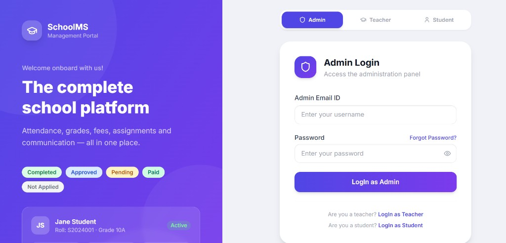
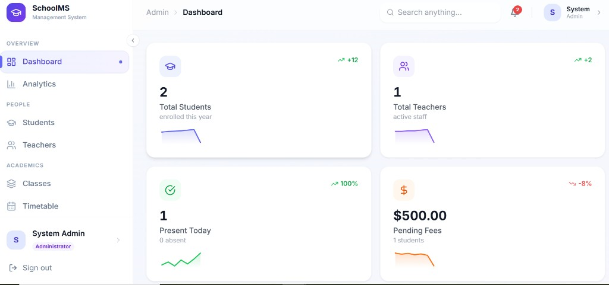
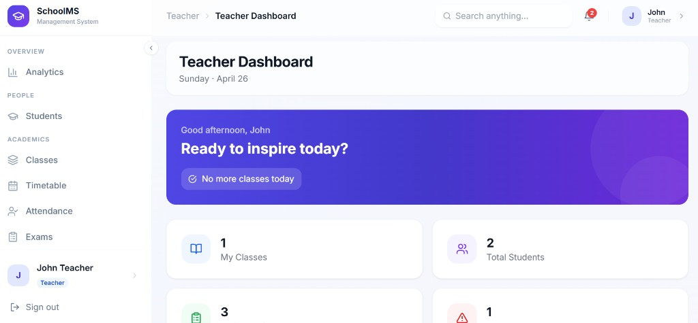
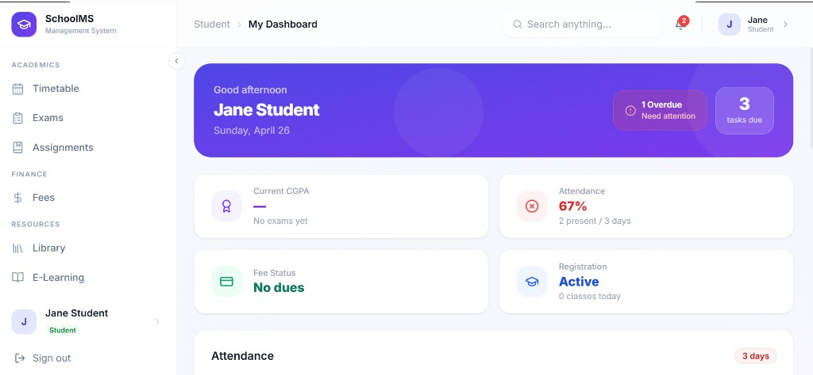
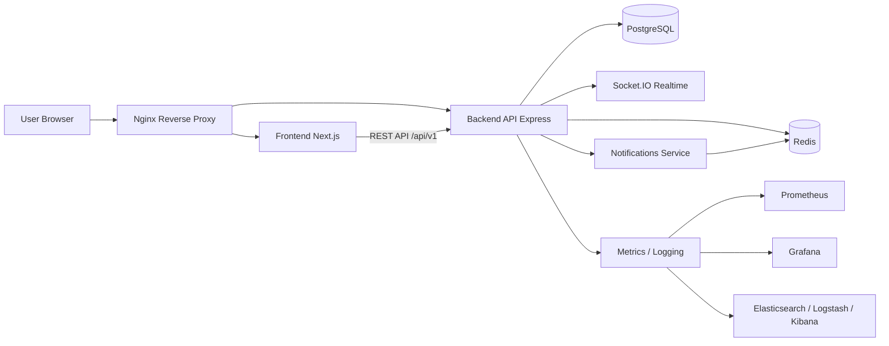

# SchoolMS - School Management System

[](https://github.com/TemiKayode/School/actions/workflows/ci.yml)


SchoolMS is a full-stack platform for managing school operations across Admin, Teacher, Student, and Parent roles.

It includes academic operations, attendance, exams, fees, messaging, notifications, e-learning, and deployment-ready infrastructure with Docker, Nginx, and Kubernetes manifests.

## Quick Start

For first-time setup:

**Windows PowerShell**

```powershell
npm install
Copy-Item .env.example .env
npm run db:migrate
npm run db:seed
npm run dev
```

**macOS / Linux**

```bash
npm install
cp .env.example .env
npm run db:migrate
npm run db:seed
npm run dev
```

Open:

- Frontend: `http://localhost:3000` (or next available port shown in terminal)
- Backend API: `http://localhost:5000/api/v1`

## Demo Credentials

Use these seeded accounts after running `npm run db:seed`:

| Role | Email | Password |
| --- | --- | --- |
| Admin | `admin@school.com` | `Admin@123` |
| Teacher | `teacher@school.com` | `Admin@123` |
| Student | `student@school.com` | `Admin@123` |

## Page Previews

### Homepage / Login



### Admin Dashboard



### Teacher Dashboard



### Student Dashboard



## Core Flow



## Features

- Role-based dashboards: Admin, Teacher, Student, Parent
- Student lifecycle: enrollment, class assignment, attendance, exams, report cards
- Academic workflows: classes, timetable, assignments, e-learning
- Finance workflows: fee setup, payment records, statements
- Transport and library management modules
- In-app notifications, messaging, and push support
- OAuth, JWT auth, MFA support, GDPR and metrics middleware

## Tech Stack

- Frontend: Next.js 14, React, TypeScript, Tailwind CSS, TanStack Query
- Backend: Node.js, Express, TypeScript, Prisma
- Database: PostgreSQL
- Cache/Queue support: Redis
- Realtime: Socket.IO
- Infra: Docker Compose, Nginx, Kubernetes
- Monitoring: Prometheus, Grafana, ELK

## Project Structure

```text
backend/         Express API + Prisma
frontend/        Next.js web app
mobile/          Mobile client
services/        Supporting microservices (notifications)
k8s/             Kubernetes manifests
nginx/           Reverse proxy config
monitoring/      Prometheus, Grafana, Logstash config
docs/images/     README screenshots
```

## Run Locally

### Prerequisites

- Node.js 18+
- npm
- Docker + Docker Compose (recommended for full stack)

### Option 1: Local Node Workspaces

```bash
npm install
npm run dev
```

- Frontend: `http://localhost:3000` (or next available port)
- Backend: `http://localhost:5000`

### Option 2: Docker Compose

```bash
npm run docker:up
```

Services include frontend, backend, postgres, redis, nginx, monitoring, and logging stack.

## Deployment

### Nginx

Nginx routes:

- `/` -> frontend service
- `/api/` -> backend service

See `nginx/nginx.conf`.

### Kubernetes

Kubernetes manifests are available in `k8s/` for:

- namespace, secrets
- backend, frontend
- postgres, redis
- notifications service
- ingress

Apply in order (example):

```bash
kubectl apply -f k8s/namespace.yml
kubectl apply -f k8s/secrets.yml
kubectl apply -f k8s/postgres.yml
kubectl apply -f k8s/redis.yml
kubectl apply -f k8s/backend.yml
kubectl apply -f k8s/frontend.yml
kubectl apply -f k8s/notifications-service.yml
kubectl apply -f k8s/ingress.yml
```

## Environment Variables

Use `.env.example` as the template for required variables.

Key values:

- `DATABASE_URL`
- `REDIS_URL`
- `JWT_SECRET`
- `REFRESH_TOKEN_SECRET`
- `NEXT_PUBLIC_API_URL`
- payment provider secrets (Stripe/PayPal/Flutterwave)

## License

For school/internal or educational use. Add your preferred license before public distribution.
